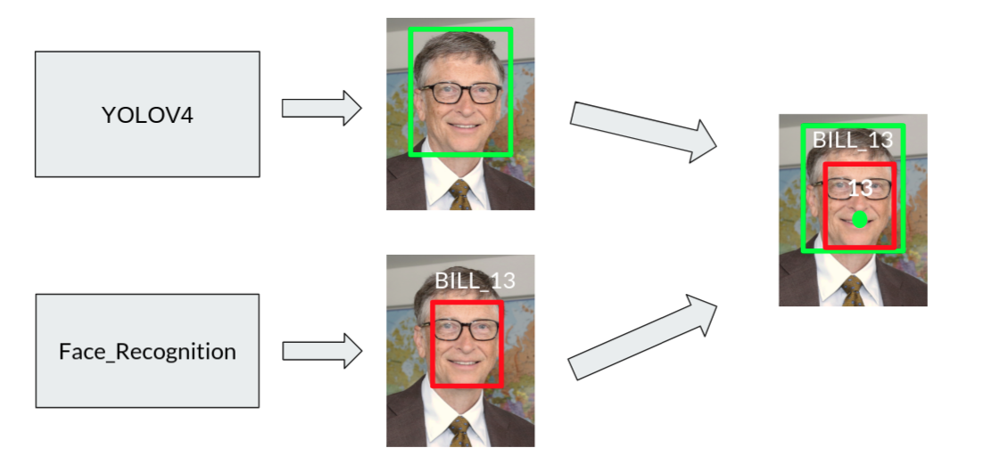

## Install mandatory packages
``` 
pip install dlib
pip install face_recognition
pip install imutils
pip install opencv-python
pip install pickle
```
_In my opinion, if you want to install the libs that were defined above, you'd better install these on Ubuntu._
> Note that, if you want to run these scripts on your external Nvidia GPU, you need to compile `dlib` and `opencv-python` packages from scratch. If you're going to run these scripts on CPU, you have to change `DETECTION_METHOD` constant to `hog`
> 
> [Compile and install Dlib from source code](https://learnopencv.com/install-dlib-on-ubuntu/)
> 
> [Install CUDA, cuDNN, and compile OpenCV from source with DNN support](https://ichi.pro/tr/cuda-destekli-opencv-dnn-ile-yolov4-52704766998916)


> **You can download the YOLOv4 weights, cfg, and classes here:** https://gurl.pro/6gzy5q
> 
> Make sure you change the file paths in `constants.py`


<hr>

## 1 - Generating a face dataset
First, you need to create a face dataset before the tracking. Each staff have to take 30 or 40 photos. More photos mean to more precisely face detection, but there is a limitation about taking photo, the tracking algorithm will be running slowly if there are more than 50 photos for each staff. So, you have to consider these situations while you're taking photos.

Make sure you already have a python3, and you need to attach `--name --lastName --phoneNumber` arguments after the .py file.

`python gen_face_dataset.py --name staffName --lastName staffSurname --phoneNumber staffPhone`

`Press the "S" key, it saves the current frame to face_dataset/{full_name}_{staffId}`

This script saves staff's photos to under the face dataset folder, then it sends a POST request to the API and adds to the database.

`HTTP POST: https://localhost:5001/api/Staff`

## 2 - Encoding faces to 128-d vectors
Second, We cannot track staffs by only using their photos, so you need to encode all staff photos that are under the face dataset folder as 128-d vectors by using face_recognition library. If want to read more about the 128-d vectors, [Adam Geitgey, Machine Learning is Fun](https://medium.com/@ageitgey/machine-learning-is-fun-part-4-modern-face-recognition-with-deep-learning-c3cffc121d78)

`python encode_faces.py`

 After that, an encodings.pickle file will be saved to your files directory, where the face dataset folder is located.


## 3 - Detecting, Recognizing and Tracking
Detecting staff heads and recognizing their faces along with all the frames is quite the same.
Firstly, we have to detect and recognize all faces in the frame so that we can get all the faces recognizer centroids. After getting the recognizer centroids, we have to detect staff heads in the frame then extract their centroids too by using a pre-trained YOLOv4 model.

The complex part begins here :) We have to examine both the recognizer centroids and the Yolo centroids to calculate the minimum distance between the centroids. If a recognizer centroid is close to a Yolo centroid then we have to grab the ID number that is associated with the recognizer centroid.
We do the same steps for all centroids. Then, we have to link the ID numbers to the Yolo centroids therefore a text which contains the ID number is placed on the centroid center. So, we get this photo:



> The steps written above are applied for all cameras and the tracking process is maintained by face_tracker.py script by only using YOLOv4 for the tracking.

To start tracking staff, you need to type this on your terminal. As there is no another way to scan all available cameras in your system, the algorithm will try to access all possible cams in your system. Don't worry if you see errors in your terminal because these errors are made by OpenCV itself. 

`python face_tracker.py`

## 4 - Storing Staff Activities
If a yolo centroid exceeds the line border of the frame, the ID number which belongs to the centroid and the data would be sent to the server through the API.
`data = {StaffId, RoomId, EntryTime, ExitTime}`

`HTTP POST: https://localhost:5001/api/StaffActivity`
<hr>

_Thanks to PyImageSearch and, Adrian Rosebrock._
